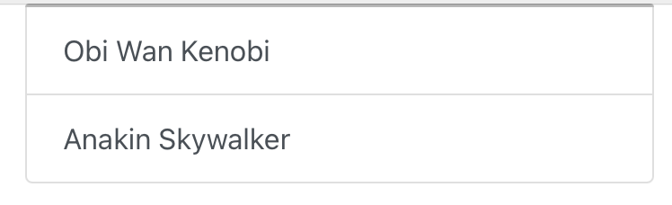
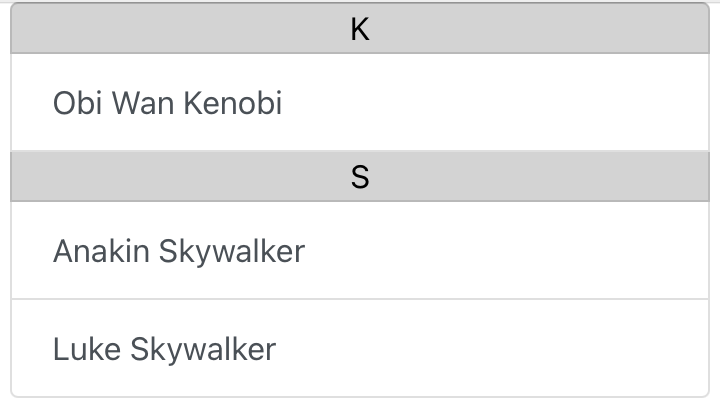
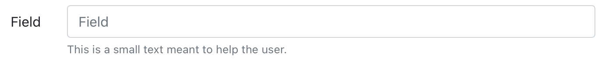

# contact

A contact manager that uses a fully customizable set of fields.

- [Deployment](#deployment)
- [Configuration file](#configuration-file)
  - [Structure](#structure)
    - [Allowed parameters](#allowed-parameters)
      - [`type`](#type)
      - [`required`](#required)
      - [`primary_key`](#primary_key)
      - [`display_name`](#display_name)
      - [`main_attribute`](#main_attribute)
      - [`sort_key`](#sort_key)
      - [`additional_type_parameters`](#additional_type_parameters)
      - [`form_help_text`](#form_help_text)
    - [Allowed types](#allowed-types)
      - [`integer`](#integer)
      - [`list`](#list)
      - [`image`](#image)
      - [`str`](#str)
      - [`long_str`](#long_str)
      - [`url`](#url)
      - [`email`](#email)
      - [`toggle`](#toggle)
      - [`select`](#select)
  - [Note on the addition of fields with a non-empty DB](#note-on-the-addition-of-fields-with-a-non-empty-db)
  - [CLI config validator](#cli-config-validator)

## Deployment

We offer a all-in-one Dockerfile that includes both the API and the front side that you can use to deploy the entire app using a single container.

Note that as the container includes everything in it, the building stage is a bit different than a normal one. You will need to provide using a `build-arg` the hostname under which your app will be served, so that the front can be configured to properly communicate with the API:

```shell
docker build -t contact --build-arg hostname="http://localhost:1337" .
```

Note that the container exposes the ports 80 for HTTP and 443 for HTTPS, but if you decide to bind them to another port for use behind a reverse proxy for example, the hostname you'll provide for the build MUST include the binded port.

Once everything is built, you simply need to run a container with the new image:

```shell
docker run -d -p 1337:80 --name contact contact
```

## Configuration file

The main point of this app is it's full customization of the fields used to create and add informations to a contact. To achieve this the API and the front uses a common `config.json` file that describes the expected fields and their respective parameters. This config file is used for multiple purposes :
- to validate the data the user wants to add
- to properly built the insertion and edit form with the right type of inputs
- to properly display the infos of the contacts

For the time being you will need to write this file yourself.

### Structure

The config file should be a valid JSON file, with an key-value array as root element. **Each key of the root array is a field of the configuration**. To each key is mapped an other key-value array that stores all the configuration of this field.

So a valid config file would look like this:

```json
{
    "field_1": {
        "param1": "value1",
        "param2": "value2"
    },
    "field_2": {
        "param1": "value1",
        "param2": "value2"
    }
}
```

**By default the key is used for the display, with the first letter uppercased**. See parameter [`display_name`](#display_name) to change this behavior when needed.

**The order in which the fields are defined in the config file defines the order used to build the insertion and edit form, as well as the order in which the infos are displayed.** The only exception to this is for the field with [`"primary_key": true`](#primary_key).

#### Allowed parameters

##### `type`

*Required*: Yes

*Type*: string

*Description*: The type of the value stored in this field. This type influences the input used in the insertion and edit form, the validation used in this form, as well as the way this values is displayed.

See the [list defined below](#allowed-types) for the allowed values.

##### `required`

*Required*: No

*Type*: boolean

*Description*: Set this to `true` to mark this field as required for the user to fill.

##### `primary_key`

*Required*: Yes, but one, and only one, field in the entire config file must have `"primary_key": true`. This field must also have `"required": true`.

*Type*: boolean

*Description*: The field used as primary key. It will not be displayed for the user, but used internally to access the contacts.

It is recommended to define a field like this in your config:

```json
"id": {
    "required": true,
    "type": "integer",
    "primary_key": true
}
```

Note that because the field with `"primary_key": true` isn't shown to the user, it's position doesn't affect the display order of the fields.

##### `display_name`

*Required*: No

*Type*: string

*Description*: This parameter allows to use a different value than the field name for the display.

For example with the following config:

```json
"lastname": {
    "display_name": "Nom",
    "type": "str"
}
```

The user will see `Nom` in the insertion and edit form, as well as in the details of a contact, while `lastname` will still be used internally.

##### `main_attribute`

*Required*: No

*Type*: number

*Description*: This parameter allows to define which field should be used to build the sidebar that list all the contacts. You can use this parameter on multiple fields at once.

When set on more than one field, all the fields that have this parameter will be used to build the sidebar. In this case they will be used in the increasing order of their value, so you mustn't have to fields with the same value for this parameter.

For example, with the following configuration:

```json
"firstname": {
    "type": "str",
    "main_attribute": 1
},
"lastname": {
    "type": "str",
    "main_attribute": 2
}
```

The sidebar will be built using first the `firstname` and then the `lastname`.

So using the previous config and the following contacts :

```json
[
    {
        "firstname": "Obi Wan",
        "lastname": "Kenobi"
    },
    {
        "firstname": "Anakin",
        "lastname": "Skywalker"
    }
]
```

The sidebar would be rendered as:



##### `sort_key`

*Required*: No

*Type*: number

*Description*: This parameter allows to defined how the list of contacts should be sorted in the sidebar. You can use this parameter on multiple fields at once.

When set on more than one field, all the fields that have this parameter will be used to sort the list of contacts. In this case they will be used in the increasing order of their value, so you mustn't have to fields with the same value for this parameter.

When at least one field has this parameter set, the contacts in the sidebar will be grouped using the field with the lowest value of `sort_key`.

For example, with the following configuration:

```json
"firstname": {
    "type": "str",
    "main_attribute": 1,
    "sort_key": 2
},
"lastname": {
    "type": "str",
    "main_attribute": 2,
    "sort_key": 1
}
```

The list of contacts will be sorted using first the `lastname` and then the `firstname`. They will also be grouped using the first letter of `lastname`.

So using the previous config and the following contacts :

```json
[
    {
        "firstname": "Obi Wan",
        "lastname": "Kenobi"
    },
    {
        "firstname": "Anakin",
        "lastname": "Skywalker"
    },
    {
        "firstname": "Luke",
        "lastname": "Skywalker"
    }
]
```

The sidebar would be rendered as:



##### `additional_type_parameters`

*Required*: Required for a few types, allowed but not required for some others. See the list below.

*Type*: key-value array

*Description*: This parameter allow to specify a more precise type when using some types listed below. See their respective type definition for the expected/allowed attributes.

- [`"type": "list"`](#list): required
- [`"type": "select"`](#list): required
- [`"type": "image"`](#list): allowed
- [`"type": "toggle"`](#list): allowed

##### `form_help_text`

*Required*: No

*Type*: string

*Description*: Use this parameter to display a help text in the insertion and edit form. This text will be displayed under the input.

So a configuration like this:
```json
"field": {
    "type": "string",
    "form_help_text": "This is a small text meant to help the user."
}
```

Would be rendered as

```html
<div class="form-group row">
    <label for="form-control-field" class="form-label col-form-label col-sm-2"><p class="text-right">Field</p></label>
    <div class="col-sm-10">
        <input name="field" placeholder="Field" aria-describedby="help-text-form-add-field" type="text" id="form-control-field" class="form-control" value="">
        <small id="help-text-form-add-field" class="form-text text-muted">This is a small text meant to help the user.</small>
    </div>
</div>
```



#### Allowed types

##### `integer`

*Form input associated*: `<input type="number">`

*Value displayed*: `{value}`

*Notes* :

##### `list`

*Form input associated*: `<input type="text">`

*Value displayed*: `{value split on the comma, and displayed according to the inner_type}`

*Notes* : You need to specify the inner type of the values of the list. This inner type will be used to validate the values inserted, as well as properly display them. To specify the inner type, use the attribute `inner_type` of `additional_type_parameters` of the field.

The allowed types as `inner_type` of a `list` are :
- `integer`
- `str`
- `url`
- `email`

For example:

```json
"emails": {
    "type": "list",
    "additional_type_parameters": {
        "inner_type": "email"
    },
}
```

##### `image`

*Form input associated*: `<input type="file">`

*Value displayed*: ``

*Notes* : It is possible to restrict the allowed type of image that can be uploaded. To do so you simply have to list them in the attribute `accepted_types` of `additional_type_parameters` of the field. For example:

```json
"photo": {
    "type": "image",
    "additional_type_parameters": {
        "accepted_types": ["png", "jpg", "jpeg"]
    }
}
```

##### `str`

*Form input associated*: `<input type="text">`

*Value displayed*: `{value}`

##### `long_str`

*Form input associated*: `<textarea>`

*Value displayed*: `{value}`

*Notes* : This type has the same value display and validation as the regular `str` type, but it is rendered as a `<textarea>` in the form, instead of a regular `<input type="text">`.

##### `url`

*Form input associated*: `<input type="url">`

*Value displayed*: `<a href="{value}">{value striped of http(s)://}</a>`

##### `email`

*Form input associated*: `<input type="email">`

*Value displayed*: `<a href="mailto:{value}">{value}</a>`

##### `toggle`

*Form input associated*: `<input type="file">`

*Value displayed*: `{value_true|'Yes'}` if toggled to True state, `{value_false|'No'}` otherwise

*Notes*: It is possible to set custom values for the True and False states. These values will then be used for display purposes, as well as when creating/editing an instance. To do you simply have to set them in the attributes `value_true` and `value_false` of of `additional_type_parameters` of the field. For example:

```json
"is_alive": {
    "type": "toggle",
    "additional_type_parameters": {
        "value_true": "Yep",
        "value_false": "Nope"
    }
}
```

Note that you cannot set only one of them. Either set both or none of them.

If custom values ar not set, *'Yes'* and *'No'* will be used as values for the True and False states.

##### `select`

*Form input associated*: `<select>[<option>{value}</option> for value in allowed_values]</select>`

*Value displayed*: `{value_true|'Yes'}` if toggled to True state, `{value_false|'No'}` otherwise

*Notes*: You need to specify the list of values that will be provided in the select. To provide them, set them as a list of strings of the attribute `allowed_values` of `additional_type_parameters` of the field. For example

```json
"team": {
    "type": "select",
    "additional_type_parameters": {
        "allowed_values": ["Blue", "Red"]
    }
}
```

### Note on the addition of fields with a non-empty DB

The live update of the configuration when you already have data inserted is possible, but with some restrictions:

- If you add a new field, the existing data won't have anything displayed for the new field. You can later edit the data to add a value if you need
- If you remove a field, the existing data won't be affected, but the removed field won't be displayed for them.
- If you edit a field, it's similar to removing it and adding a new one. You may experience some validation issues in this case, especially if you update the field's parameters, such as `required` or `type`.

### CLI config validator

Because you have to update the config file by hand for now, it's possible to make some mistakes. To prevent them, you can validate your file using the CLI config validator:

```shell
> # In api/
> python config.py config.json
```

Note that this script will simply tell you if there's anything wrong with your configuration file, but won't fix the errors for you, and most importantly won't prevent the app from running with a broken config file.
